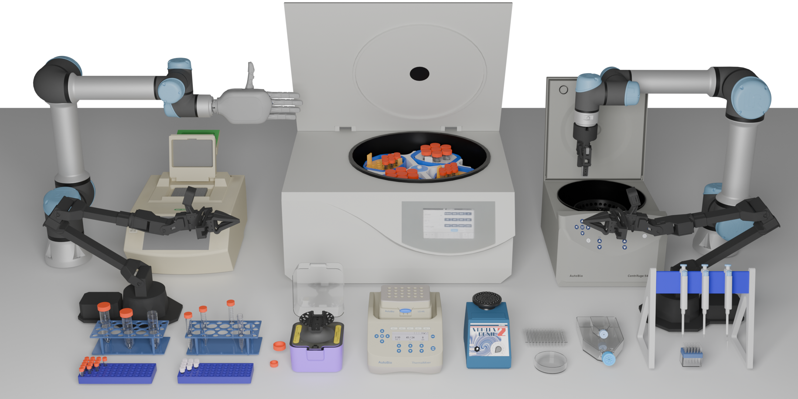

## Overview

**AutoBio** is a comprehensive simulation and benchmarking suite for robotic automation in digital biology labs. Our NeurIPS 2025 submission demonstrates how realistic instrument modeling, physics-based simulation, and expert data generation combine to advance lab autonomy.

I am the fifth author of this submission **"AutoBio: A Simulation and Benchmark for Robotic Automation in Digital Biology Laboratory".**

## Project Highlights

### Multi - stage Modeling and Simulation
- Conducted in-depth 3D modeling of laboratory instruments, such as centrifuge tube, using **SolidWorks and Blender**. These models were crafted with meticulous attention to detail, capturing the intricate geometries and structures of the instruments.Take the 1–5ml centrifuge tube as an example below.
- Composed precise **MuJoCo XML** definitions to accurately represent the collision and visual geometries of the modeled instruments. We use collision models, visual models, and so on in MuJoCo to realize complex interactions.

  
  
    <video src="1-5ml_screw_video.mp4" controls style="width:34%; height:auto;">
  </iframe>

  

  <video src="vortex_mixer_viewer.mp4" controls style="width:89%; height:auto;">

### Robotic Task Logic and Benchmarking
- Engineered sophisticated control logic and optimized trajectory planning algorithms for the Aloha and UR5e robotic arms. These algorithms are designed to handle various tasks, such as test tube transfer, capping, and mixing, demonstrating high precision and efficiency.

  <video src="close_lid.mp4" controls style="width:50%; height:auto;">
  </video>
  <video src="transfer_tube.mp4" controls style="width:50%; height:auto;">
  </video>

  <video src="screw_tube.mp4" controls style="width:50%; height:auto;">
  </video>
  <video src="vortex_mixer.mp4" controls style="width:50%; height:auto;">
  </video>

### Expert Data Generation for VLA Training
- Implemented randomized perturbations during data collection to obtain high - quality expert trajectories. These perturbations added an element of unpredictability to the tasks, simulating real - world uncertainties and ensuring that the collected data was more representative and robust.

### Figure and Asset Production
- Participated in the entire process of creating and integrating all digital, graphic and visual assets for the NeurIPS 2025 paper using **blender** .The produced visual materials were not only aesthetically pleasing but also effectively conveyed the key concepts and findings of the research, enhancing the overall clarity and impact of the paper. 

  <video src="Transfer centrifuge tube.mp4" controls style="width:50%; height:auto;">
  </video>
  <video src="Unscrew centrifuge tube cap.mp4" controls style="width:50%; height:auto;">
  </video>

---

Thank you for exploring this project. Feel free to share your thoughts! 🙌
