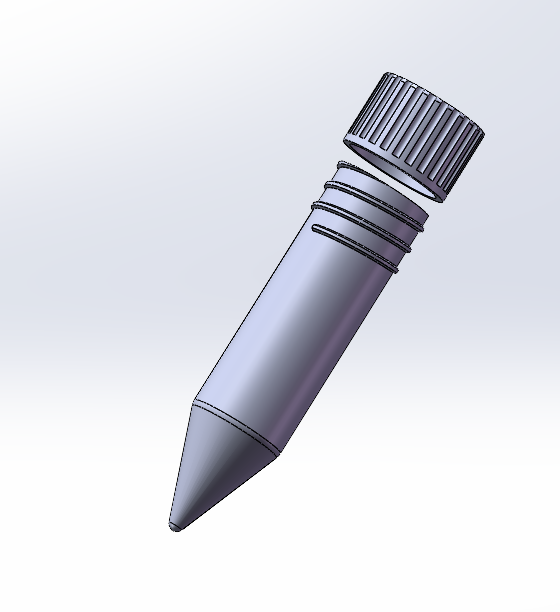
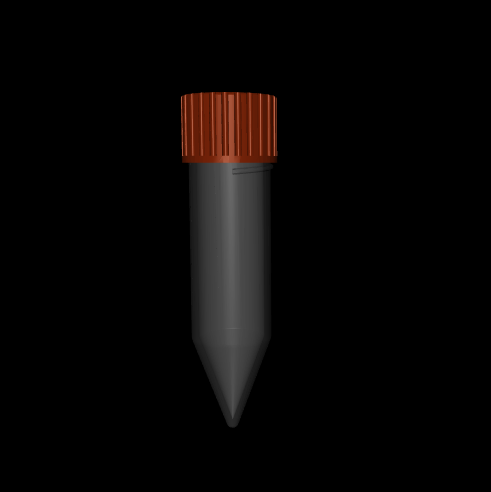

## Overview

**AutoBio** is a comprehensive simulation and benchmarking suite for robotic automation in digital biology labs. Our NeurIPS 2025 submission demonstrates how realistic instrument modeling, physics-based simulation, and expert data generation combine to advance lab autonomy.I am the fifth author of this submission "AutoBio: A Simulation and Benchmark for Robotic Automation in Digital Biology Laboratory"


## Project Highlights

### Multi - stage Modeling and Simulation
- Conducted in-depth 3D modeling of laboratory instruments, such as centrifuge tube, using SolidWorks and Blender. These models were crafted with meticulous attention to detail, capturing the intricate geometries and structures of the instruments.

  
  
    <video src="video.mp4" controls style="width:32%; height:auto;">
  </iframe>

- Composed precise MuJoCo XML definitions to accurately represent the collision and visual geometries of the modeled instruments. We use collision models, visual models, and so on in MuJoCo to realize complex interactions.
  
### Robotic Task Logic and Benchmarking
- Engineered sophisticated control logic and optimized trajectory planning algorithms for the Aloha and UR5e robotic arms. These algorithms were designed to handle a wide range of tasks, from simple operations like nut handling and test tube capping to complex mixing routines, demonstrating high - precision and efficiency.
- Devised a comprehensive benchmark suite by introducing scene randomization and creating task variants with varying levels of difficulty. This approach not only increased the diversity of the test scenarios but also provided a more rigorous evaluation of the robotic systems' performance, enabling a more accurate assessment of their capabilities.

### Expert Data Generation for VLA Training
- Implemented randomized perturbations during data collection to obtain high - quality expert trajectories. These perturbations added an element of unpredictability to the tasks, simulating real - world uncertainties and ensuring that the collected data was more representative and robust.
- Prepared well - structured datasets specifically tailored to bootstrap the learning process of Visual Language Action (VLA) models. These datasets provided a solid foundation for the models to learn and generalize from, facilitating their development and improving their performance.

### Figure and Asset Production
- Spearheaded the entire process of creating and integrating all figures, diagrams, and visual assets for the NeurIPS 2025 paper. The produced visual materials were not only aesthetically pleasing but also effectively conveyed the key concepts and findings of the research, enhancing the overall clarity and impact of the paper. 

---

感谢您的阅读！若有任何问题或建议，欢迎在下方留言。
