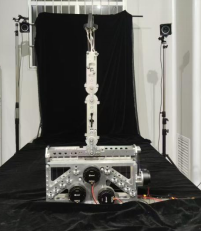
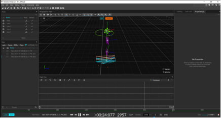

## Internship

**AI & Robotics Lab, Tsinghua University Shenzhen Graduate School**  
Beijing, China

- Calibrated and operated motion-capture systems (**OptiTrack & Motive**) to collect spatial and kinematic data from a six-axis robotic arm.  
- Established real-time communication with **MATLAB** for simulation modeling and inverse kinematics calculations.  
- Conducted error correction, data interpolation, and time-series data processing to support data-driven robotic arm control for lab research projects.

