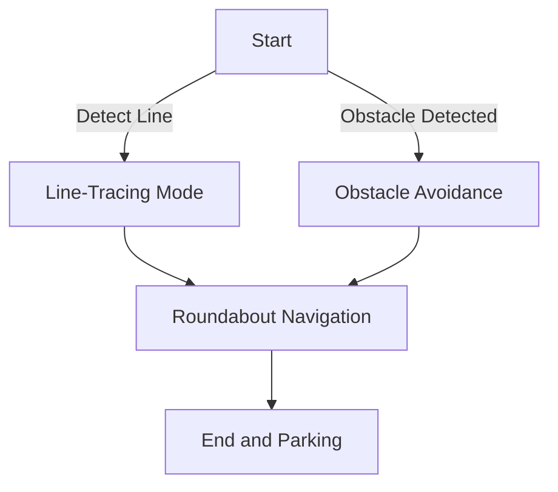

This project highlights the achievements of the **Robotics Winter Camp at Tsinghua University**, where we designed, programmed, and tested an **intelligent vehicle system** capable of autonomous navigation and obstacle avoidance. Under a competitive framework, our team earned the **Third Prize (Top 10%)** for innovative design and implementation.



## Competition Highlights

- **Objective**:
  - Design an autonomous robotic car capable of completing tasks such as **line tracing**, **roundabout navigation**, and **obstacle avoidance** on a standardized track.
  - Ensure integration of hardware and software for optimized performance.

- **Key Features**:
  - Intelligent start and stop using Bluetooth or sensors.
  - Effective lane following through advanced image processing algorithms.
  - Precise obstacle avoidance and detection using ultrasonic sensors.

## Project Achievements

- **Hardware Design**:
  - Integrated essential sensors, including:
    - Ultrasonic distance sensors for obstacle detection.
    - Camera modules for visual guidance and line tracking.
  - Developed a high-performance motion control system for smooth navigation.

- **Software Implementation**:
  - Implemented navigation algorithms using C programming.
  - Enhanced vehicle autonomy with image thresholding and multi-point curve analysis.
  - Achieved real-time lane detection with dynamic correction for unexpected conditions.

## Flowchart: Task Workflow

## Challenges and Innovations

- **Navigational Precision**: Resolved challenges in sharp turn adjustments using PID control for motor and steering systems.
- **Data Fusion**: Combined inputs from multiple sensors (camera, ultrasonic, IMU) for a reliable decision-making framework.
- **Scalable Design**: Modular approach allowed easy replacement and testing of hardware components.

Thank you for exploring this project. Feel free to share your thoughts! 🙌

