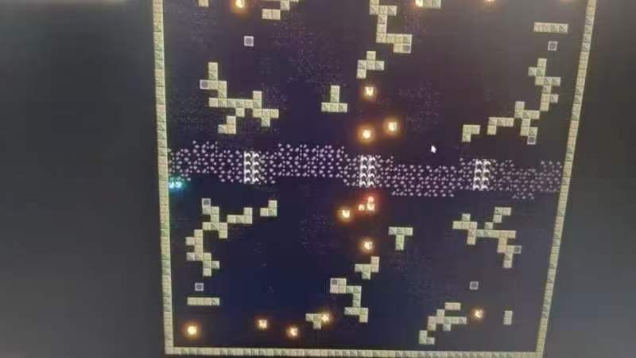
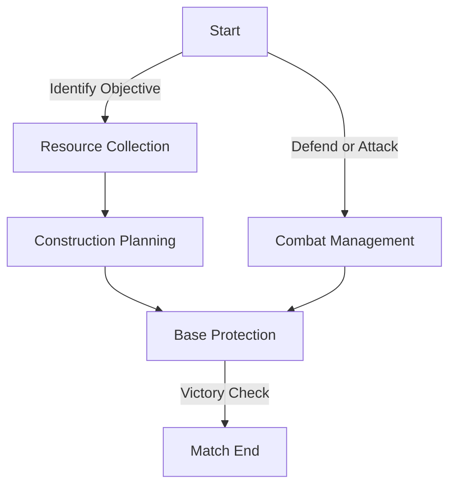

This project showcases the development of intelligent algorithms for controlling spacecraft in a **real-time strategy simulation** during the **Tsinghua AI Challenge**. The system integrates resource management, construction, and combat mechanics within competitive constraints, earning the **Third Prize (Top 10%)**.

## Competition Highlights

- **Gameplay Overview**:
  - Two teams compete in each match, played on four distinct maps.
  - Objectives include **constructing buildings**, **extracting resources**, and **destroying enemy bases**.
  - Each match ends when either:
    - One team's base is destroyed.
    - The match duration (10 minutes) elapses.
  - Scores are calculated after each match, and the team with the higher score wins.

- **Task Structure**:
  - Players control five characters (PlayerID 0–4), including:
    - **1 Base (PlayerID 0)**: Acts as the team's headquarters.
    - **4 Ships (PlayerID 1–4)**: Divided into:
      - Civil Ships: Maximum 2 per player.
      - Military Ships: Maximum 2 per player.
      - Flagship: Maximum 1 per player.

## Project Achievements

- Developed real-time algorithms in **C++** for:
  - Optimizing **resource extraction** from predefined points using AI-controlled paths.
  - Managing the **construction of buildings** at strategic locations.
  - Directing ships during combat using decision-making systems.
- Designed an **adaptive navigation system** with an A* pathfinding algorithm for optimal movement.
- Implemented **combat strategies** that leverage energy, positioning, and multi-agent coordination to eliminate enemies and protect assets.

## Technical Architecture

### State Machine Flow

### Key Features:
1. **A* Pathfinding**: Facilitates efficient movement across complex maps.
2. **Modular Communication**:
   - Implemented **UART-based protocols** for seamless real-time communication between agents.
3. **Multi-Agent Coordination**:
   - Integrated algorithms for dynamic role switching between offensive, defensive, and resource collection tasks.

## Challenges and Solutions

1. **Resource Scarcity**:
   - Balanced team strategies to maximize resource extraction efficiency.
   - Addressed potential contention through optimized task allocation.
2. **Navigation Obstacles**:
   - Enhanced pathfinding accuracy using map preprocessing and heuristic adjustments.

---

Thank you for exploring this project. Feel free to share your thoughts! 🙌

