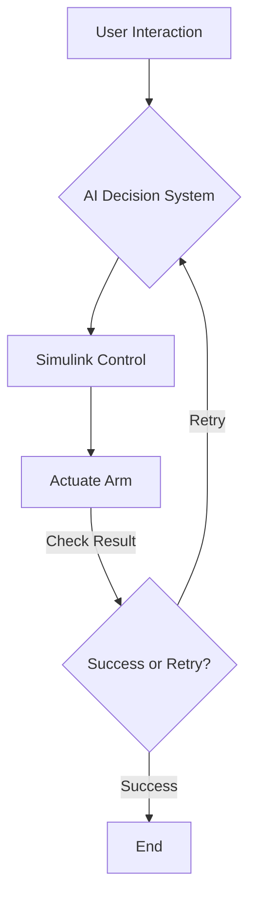
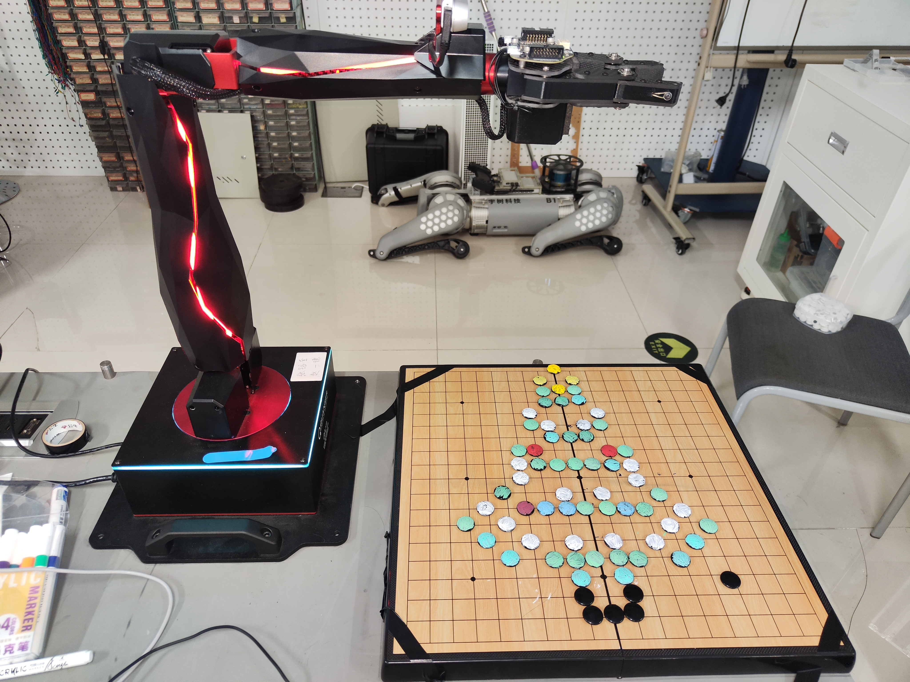

This project introduces an advanced **chess-playing robotic arm system**, which leverages distributed architecture, intelligent decision-making, and precise control techniques.

Below are three videos showcasing the robot's capabilities: human-robot chess interaction, drawing a Christmas tree, and creating a heart.







## Project Highlights

- Designed and implemented a QARM four-axis robotic arm system to enable **human-robot chess interaction** and **drawing tasks**.
- Developed control and decision systems integrating multiple platforms:  
  - **MATLAB** for workspace simulation and initialization.  
  - **Simulink** for robot control logic, inverse kinematics, and sequence logic design.  
  - **Visual Studio** for decision-making algorithms utilizing a pre-trained chess AI.
- Innovated a **magnet-assisted gripper** and a passive leveling tool using gravity to ensure horizontal placement in under-actuated operations, enhancing accuracy and compatibility with robotic arms of **varying DoF**.
- Applied **plane fitting algorithms** to correct robotic arm positional errors, ensuring accurate precision.   

---

## Flowchart: Decision and Motion Process

Below is a simplified **flowchart** describing how various modules interact:

---

## Challenges and Innovations

### Key Challenges:
1. **Precision Issues**:  
   Initial central alignment strategies led to XY and Z errors due to under-actuation.  
   Solution: Plane fitting using calibration points and fitted matrix algorithms.
2. **Magnet Control**:  
   Balanced magnetic forces between chess pieces and the board, ensuring stable pickup and release.
3. **Integration Limitations**:  
   Bridged communication challenges between **MATLAB**, **Visual Studio**, and **Simulink** using **TCP/IP communication**，CSV files and memory-based data sharing.

### Innovations:
- **Passive Adaptive Gripper**: Maintains a horizontal placement for under-actuated end-effectors via gravity-driven rotation.
- **Distributed System Architecture**: Partitioned decision-making, control, and vision across three independent modules for enhanced scalability.

---

Thank you for exploring this project. Feel free to share your thoughts! 🙌
