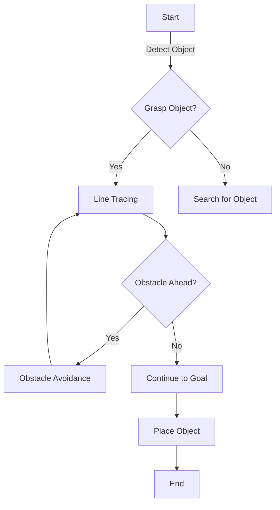

This project introduces a self-designed **intelligent vehicle system**, capable of completing challenging tasks including **line tracing, obstacle avoidance, and object grasping** under competitive constraints. The system integrates custom hardware design, embedded software development, and efficient control algorithms.

## Project Highlights

- **Hardware Design**: 
  - Constructed a compact, two-layer vehicle chassis with a footprint of **200x200 mm**, ensuring agility and stability in competitive environments.
  - Integrated a **two-wheel differential drive system**, paired with an auxiliary omni-wheel for directional control.
  - Developed a **two-degree-of-freedom grasping mechanism**, utilizing servo-driven claws with sponge linings for precision handling.

- **Software Features**:
  - Implemented a state machine in **STM32 C**, facilitating seamless switching between line-tracing, obstacle-avoidance, and grasping states.
  - Utilized **OpenMV's camera module** for image processing tasks, including object recognition, line detection, and terminal area identification.
  - Designed **PID speed control algorithms** for responsive movement and smooth turns during high-speed line tracing.

- **Technical Achievements**:
  - Demonstrated sub-second response times during **line-tracing tasks**.
  - Achieved error-free obstacle avoidance using custom **ultrasonic fusion algorithms** and IMU-based correction mechanisms.
  - Utilized **LAB color space processing** to eliminate interference from shadows and improve recognition reliability.

---

## Data Visualization

### Vehicle Path Simulation

To illustrate the vehicle's trajectory and performance, use the following shortcode to embed a dynamic path map:

```go

```

---

## Flowchart: Task Logic and System Workflow

Below is the **state-machine flowchart**, detailing how the system transitions between states:



---

## Challenges and Innovations

### Key Challenges:
1. **Grip Stability**: Initial claw dimensions caused frequent failures in grasping objects. Redesigned the mechanism to increase grasp area and stability.
2. **Obstacle Navigation**: Utilized ultrasonic modules to improve object detection, resolving interference issues caused by sensor proximity.
3. **Trajectory Optimization**: Combined OpenMV image analysis and PID speed tuning to enhance navigation precision at high speeds.

### Innovations:
- Designed an **adaptive grasping mechanism** with motion-driven retraction to optimize handling and prevent obstructed vision.
- Employed **inverse perspective transformation** to ensure accurate line tracking by transforming camera images into a bird’s-eye view.
- Developed a hybrid obstacle-avoidance algorithm, combining **IMU-based correction** and **ultrasonic edge-detection** for reliable decision-making.

---

## Additional Resources

For further details, explore the following references:
1. [Hugo Documentation for Data Visualization](https://gohugo.io)
2. [OpenMV for Embedded Vision Processing](https://openmv.io)
3. [STM32 Development Guide](https://www.st.com)

---

Thank you for reviewing this project. Feel free to reach out for collaboration or inquiries! 🙌
