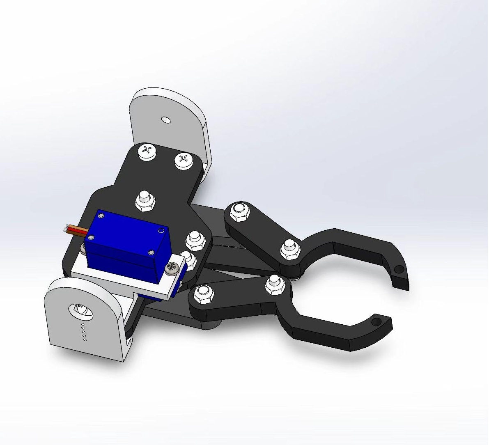
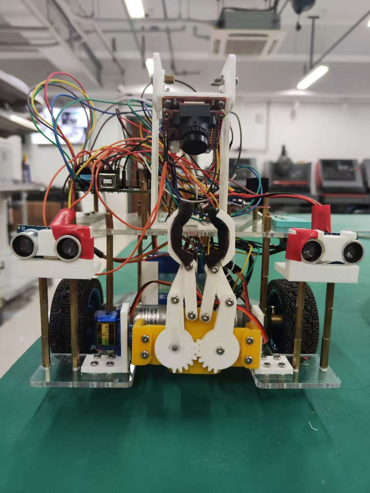
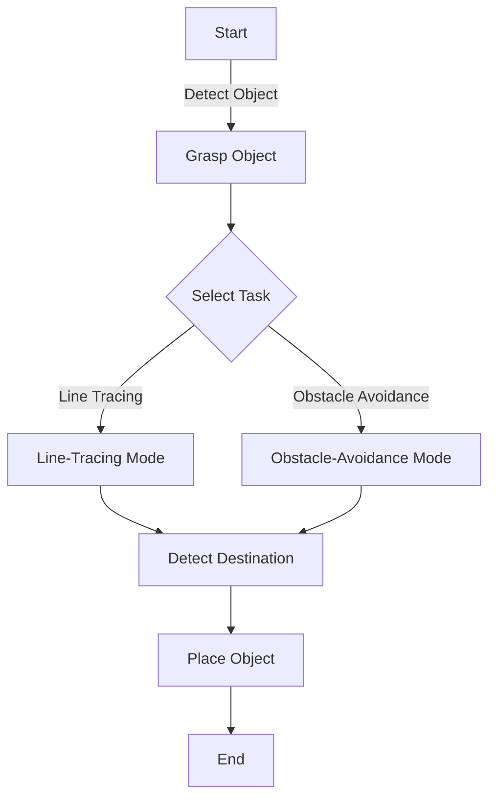

This project showcases the design and implementation of an **intelligent vehicle system**, developed to perform three complex tasks: **line tracing**, **obstacle avoidance**, and **object grasping**. 
The project integrates advanced software algorithms and innovative hardware structures, ensuring efficiency and flexibility in real-world applications.

Below are the videos demonstrating the intelligent vehicle's line-tracing and obstacle-avoidance tasks.





## Project Highlights

- **Line-Tracing Task**: 
  - Leveraged OpenMV for image-based navigation along pre-defined tracks, using **dynamic thresholding** for accurate path detection.
  - Developed PID-based speed control to maintain stability on sharp turns and narrow paths.

- **Obstacle-Avoidance Task**: 
  - Implemented a hybrid algorithm using **ultrasonic sensors** and IMU data to detect and bypass obstacles while navigating toward the destination.
  - Used precise wall-following techniques to avoid getting trapped in loops during obstacle avoidance.

- **Object Grasping Integration**: 
  - Designed a lightweight, adaptive gripper driven by SG90 servos, ensuring stability during transport.
  - Integrated grasping and placing processes seamlessly into both line-tracing and obstacle-avoidance tasks.

## Hardware Design

- Constructed a two-layered chassis using 3D printing for efficient weight distribution, ensuring lightness and stability.
- Adopted **two-wheel differential drive** for high maneuverability, supported by a rear omni-wheel for balance.
- Integrated sensors (ultrasonic, IMU, OpenMV) with strategic placements for optimal data collection and processing.

## Software Architecture

### State-Machine Logic

### Key Features
1. Utilized **OpenMV** for real-time image processing and object recognition.
2. Communicated between modules using UART and Bluetooth protocols, ensuring real-time responsiveness.
3. Enhanced task precision through the fusion of **dynamic state transitions** and **control algorithms**.

## Innovations

- Developed a **two-degree-of-freedom grasping mechanism**, utilizing servo-driven claws with sponge linings for precision handling.
- Implemented **LAB color space processing** to reduce lighting-related inaccuracies during line tracing.
- Integrated adaptive algor56ithms to dynamically balance speed and accuracy for different tasks.

## Challenges and Solutions

### Line-Tracing Challenges
- **Sharp Turns**: Improved PID tuning to handle tight curves without losing track.
- **Shadow Interference**: Applied dynamic threshold adjustments to minimize errors caused by varying lighting.

### Obstacle-Avoidance Challenges
- **Sensor Interference**: Reduced ultrasonic sensor cross-talk through time delays between pings.
- **Navigation Deadlocks**: Implemented wall-following corrections to bypass loop scenarios.

---

Thank you for exploring this project. Feel free to share your thoughts! 🙌
